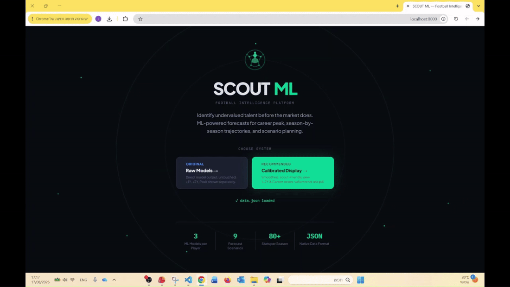

# Football Market Value Forecasting

**Machine Learning Decision-Support System for Football Scouting**

An end-to-end Machine Learning project for forecasting the future market value of professional football players based on historical performance, career progression, and market-value data.

The project was developed as a **Proof of Concept (PoC)** for a broader scouting decision-support system: rather than estimating only a player's current value, the goal is to provide a data-driven view of their **future economic potential and uncertainty**.

---

## Demo



▶️ **[Watch the full demo](https://drive.google.com/file/d/1Fv764Jmv0BCrODNTb9_o60kTf9SmEI6Y/view?usp=sharing)**

---

## The Problem

Football clubs evaluate thousands of potential players while trying to balance:

- Current professional performance
- Future sporting potential
- Acquisition cost
- Future market value
- Financial risk

Traditional scouting data is highly useful for evaluating current performance, but it does not directly answer questions such as:

> **How might this player's market value evolve over the next one or two years?**

This project explores whether historical performance and career data can be transformed into useful probabilistic forecasts of future player market value.

The system is intended as an **additional decision-support layer for scouting and player acquisition**, not as an automatic replacement for professional scouting.

---

# Proof of Concept

## Data

The initial PoC combines two main data sources:

### Player Performance Data

Historical player-season data covering approximately:

- **40,000 players**
- Around **40 leagues and international competitions**
- Seasons from **2017/18 to 2024/25**
- More than **100 performance and contextual variables per player-season**

The data includes information such as:

- Appearances and minutes
- Goals and assists
- Passing
- Defensive actions
- Duels
- Shooting
- Position
- Team and competition context
- Age and career history

### Market Value Data

Historical player market-value observations were matched to the performance data.

These observations allow the system to reconstruct each player's market-value trajectory over time and create future forecasting targets.

---

# Machine Learning Pipeline

The project was built as a temporal Machine Learning pipeline:

```text
Raw Performance Data
        ↓
Data Cleaning & Player Matching
        ↓
Historical Market Value Integration
        ↓
Time-Based Player Snapshots
        ↓
Feature Engineering
        ↓
Model Training
        ↓
Quantile Forecasting
        ↓
Future Market Value Estimates
```

A central design requirement was to ensure that every training observation contains **only information that would have been available at that point in time**, avoiding future-data leakage.

---

## 1. Data Cleaning & Integration

The preprocessing stage includes:

- Player identity matching across data sources
- Season alignment
- Missing-value handling
- Position normalization
- Removal of invalid or insufficient observations
- Integration of historical market-value observations
- Construction of time-valid player histories

---

## 2. Feature Engineering

Raw season statistics alone do not fully represent a player's career trajectory.

The project therefore creates features describing both **current performance and historical development**.

Examples include:

### Performance Features

- Per-90 performance statistics
- Appearance and playing-time measures
- Offensive and defensive statistics
- Position-specific indicators

### Career Development

- Historical performance trends
- Season-to-season changes
- Career momentum
- Recent improvement or decline
- Previous market-value development

### Player Context

- Age
- Position
- Competition
- Club and league context
- Career stage

### Data Reliability

Players with limited minutes or small samples require different treatment from established starters.

The preprocessing therefore includes techniques designed to reduce the influence of unstable statistics from small samples.

---

# Forecasting Approach

## XGBoost Quantile Regression

The main PoC uses **XGBoost Quantile Regression**.

Instead of producing only a single point prediction, the model estimates several possible parts of the future-value distribution.

For example:

| Forecast | Interpretation |
|---|---|
| Lower Quantile | Conservative / downside estimate |
| Q50 | Median expected outcome |
| Q75 | Strong development scenario |
| Upper Quantile | High-upside scenario |

This allows the output to represent **forecast uncertainty** rather than presenting one future value as certain.

---

## Forecasting Horizons

The project investigates future market value at multiple horizons, including:

- **1-year horizon**
- **2-year horizon**
- **Future career peak**

This enables different scouting questions to be explored.

For example:

> What could this player be worth relatively soon?

versus:

> What is the player's longer-term economic upside?

---

# Example Output

For a given player, the model can produce a range such as:

```text
Current Market Value        €10.0M

Future Forecast
--------------------------------
Conservative Estimate        €11.5M
Median Estimate              €15.8M
Higher-Upside Estimate       €20.4M
Optimistic Estimate          €25.1M
```

The purpose is not to claim that the player **will** reach a specific value, but to provide a structured estimate of possible future outcomes.

---

# Model Evaluation

The modeling process uses player-based and time-aware validation to reduce leakage between observations belonging to the same career.

Evaluation focuses on both:

- **Prediction error**
- **Ability to rank players by future potential**

The model is compared against simpler baseline forecasts to verify that historical performance and career information provide useful predictive signal beyond current market value alone.

---

# Why Quantile Forecasting?

Player development is inherently uncertain.

Two players with similar current statistics can have very different future trajectories because of:

- Age
- Career stage
- Playing opportunities
- League progression
- Injuries
- Transfers
- Contract situation
- Changes in performance

A single prediction hides this uncertainty.

Quantile regression instead provides a range of plausible outcomes, making it more suitable for a **risk-aware scouting decision-support system**.

# Technologies

### Machine Learning & Data

- Python
- XGBoost
- Scikit-learn
- Pandas
- NumPy

### Analysis & Visualization

- Matplotlib
- Jupyter

### Development

- Git
- VS Code
- Claude Code

---

# AI-Assisted Development

Claude Code was used as an **AI-assisted development tool** throughout parts of the implementation process, including:

- Code implementation support
- Iterative development
- Testing and validation
- Refactoring
- Experimentation support

The project architecture, research problem, modeling decisions, feature-engineering process, experimental direction, and evaluation were developed as part of the project itself, with AI used as a development-support tool.

---

# Project Goal

The long-term goal is to develop a system that can help scouting and recruitment teams move from a very large pool of players toward a smaller set of relevant candidates while adding an additional dimension:

> **What is the potential economic development of this player, and how uncertain is that forecast?**

The system is designed to complement professional scouting, performance analysis, and club-specific evaluation rather than replace them.

---

**Ido Harel**  
B.Sc. Information Systems Engineering  
Data Science Focus  
Ben-Gurion University
