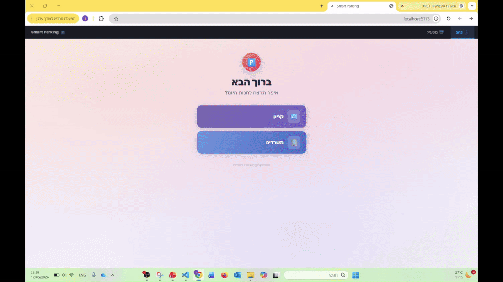

# Smart Parking System

A real-time parking guidance system with vehicle routing, spot assignment,
and pedestrian navigation. Built with FastAPI (Python) + React.

Designed from the ground up so that **connecting real hardware requires
changing only a handful of lines** — see [`REAL_HARDWARE_INTEGRATION.md`](./REAL_HARDWARE_INTEGRATION.md).

---
## What it does

| View | What you see |
|---|---|
| **Driver** (`👤 נהג` tab) | Pick a destination group (קניון / משרדים), answer the accessibility-badge question, and the server picks the floor **and** the spot automatically. Then Waze-style turn-by-turn driving to the spot. Includes "I parked somewhere else" manual override. |
| **Find My Car** | Reached from inside the Driver tab after parking. Walk from an elevator or entrance back to the parked car, with step-by-step pedestrian navigation on a dedicated walking graph. |
| **Operator** (`🖥️ מפעיל` tab) | Live top-down map per floor, 60 fps smooth vehicle movement, statistics, event log, layout/scenario switching, speed slider, and manual spawn/steal/free controls. |

The app has exactly two top-level tabs (`frontend/src/App.jsx`). Find My Car is a
screen inside the Driver flow, not a third tab.

## Demo



▶️ [Watch the full demo - user view](https://drive.google.com/file/d/1ieZtvs6f6Qa5-rXbEMKGwf4GR4F6v8yu/view?usp=sharing)
▶️ [Watch the full demo - operator and algorithmic view](https://drive.google.com/file/d/1VTN1o-60vLxvMoQBK178hhFcByqA3e2c/view?usp=sharing)

# Smart Parking System

A real-time parking guidance system with automatic spot assignment, vehicle
routing, and pedestrian navigation. FastAPI (Python) backend + React (Vite)
frontend. The UI is in Hebrew (RTL); all code, comments and docs are English.

Designed so that **connecting real hardware requires changing only a handful of
lines** — see [`REAL_HARDWARE_INTEGRATION.md`](./REAL_HARDWARE_INTEGRATION.md).
The selection algorithm itself is documented in [`ALGORITHM.md`](./ALGORITHM.md).

---

## Quick Start

### Requirements
- Python 3.9+ (the Docker image uses 3.11)
- Node.js 18+ (the Docker build stage uses Node 20)

### 1 — Backend

```bash
pip install -r requirements.txt
uvicorn server:app --reload --host 0.0.0.0 --port 8000
```

`requirements.txt` pins:

```
fastapi>=0.110.0
uvicorn[standard]>=0.27.0
websockets>=12.0
pydantic>=2.0.0
```

On first start the server builds the offline routing tables for the default
layout and writes them to `data/offline_<layout-hash>.pkl`. This takes a few
seconds for the large layouts; subsequent starts load from cache in
milliseconds. `data/` is created relative to the **current working directory**,
so run `uvicorn` from the project root.

### 2 — Frontend (development)

```bash
cd frontend
npm install
npm run dev          # → http://localhost:5173
```

Vite proxies `/api` and `/ws` to `http://localhost:8000` (`frontend/vite.config.js`),
so both servers can run side by side.

### 2 (alternative) — Frontend (production build)

```bash
cd frontend
npm install && npm run build
# then just use the backend: http://localhost:8000
```

When `frontend/dist/` exists, `server.py` mounts `/assets` and serves
`index.html` for every other path (SPA fallback).

### 3 — Docker / Railway

```bash
docker build -t smart-parking .
docker run -p 8000:8000 smart-parking
```

The `Dockerfile` is a two-stage build (Node builds the frontend → Python runs
the server and serves `dist/`). `railway.toml` sets the health check to
`/api/server_token` and restarts on failure. Railway injects `PORT`; the server
is started with `--workers 1` because all state is in-memory and is not shared
across workers.

---

## Project Structure

```
smart_parking_v16_to_upload/
│
├── server.py                    FastAPI backend — HTTP + WebSocket + adapter wiring
├── requirements.txt
├── Dockerfile                   Two-stage build (Node → Python)
├── railway.toml                 Railway health check + restart policy
├── .dockerignore / .gitignore
├── README.md                    ← you are here
├── ALGORITHM.md                 ← spot-selection + reassignment algorithm
├── REAL_HARDWARE_INTEGRATION.md ← how to connect real sensors and beacons
│
├── core/                        All Python logic — pure, testable, no web framework
│   ├── __init__.py
│   ├── adapters/                Hardware abstraction layer (swap sim ↔ real)
│   │   ├── __init__.py          Exports every adapter class
│   │   ├── sensor_adapter.py    Spot occupancy: Simulated / REST / MQTT / Webhook
│   │   └── position_adapter.py  Vehicle + pedestrian positioning: Sim / RFID / BLE
│   │
│   ├── graphs.py                Node + Graph data structures
│   ├── dijkstra.py              Shortest-path engine (driving + pedestrian)
│   ├── layout_loader.py         Load + validate layout JSON files
│   ├── offline.py               Pre-compute all routing tables at startup (cached)
│   ├── floor_selection.py       PRIMARY spot + floor selection (spiral + competition)
│   ├── scoring.py               Legacy ranking fallback (used when the primary
│   │                            selector finds nothing, and for exit/entrance modes)
│   ├── simulation.py            Routing decisions, state transitions, reassignment
│   ├── pedestrian.py            6-layer pedestrian graph + walk route computation
│   ├── scenarios.py             Scenario presets (Demo / full sim / manual 80% / …)
│   ├── config.py                Loads settings.json into CFG
│   └── settings.json            Tunable thresholds (speeds, radii, weights)
│
├── data/                        Offline cache — offline_<hash>.pkl (git-ignored)
│
├── layouts/                     Four facility layouts (operator can switch at runtime)
│   ├── azrieli_dual_lanes.json     2 floors ·  150 spots · small demo layout
│   ├── azrieli_mall_large.json     2 floors · 1440 spots · DEFAULT at startup
│   ├── azrieli_mall_3floor.json    3 floors · 2160 spots
│   └── synthetic_3floor.json       3 floors ·  120 spots · single entrance
│
└── frontend/
    ├── index.html
    ├── package.json             react 18 + vite 5 (no other runtime deps)
    ├── vite.config.js           dev proxy for /api and /ws
    └── src/
        ├── main.jsx
        ├── App.jsx                  Two tabs: Driver / Operator
        ├── api/
        │   └── parkingApi.js        REST client
        ├── hooks/
        │   ├── useParking.js        Central state: layout, spots, vehicles, stats
        │   └── useWebSocket.js      Auto-reconnecting WS client (1 s retry, 20 s ping)
        ├── canvas/
        │   ├── ParkingRenderer.js   Operator 2D top-down map renderer
        │   ├── VehicleLayer.js      Operator-map vehicle interpolation + heading slerp
        │   └── WazePerspective.js   Driver perspective renderer (road surface, turns)
        └── views/
            ├── DriverView.jsx       Driver flow: choose → badge → navigate → parked
            ├── FindMyCarScreen.jsx  Pedestrian navigation (walk to parked car)
            ├── NavCanvas.jsx        Driver navigation canvas + 60 fps camera lerp
            ├── FloorCanvas.jsx      Per-floor map (used in operator view)
            └── OperatorView.jsx     Operator dashboard
```

`frontend/node_modules/` is present in this archive but is git-ignored and
rebuilt by `npm install` / Docker.

---

## Architecture

### Communication

```
Browser                              FastAPI Server
  │                                       │
  ├─ GET  /api/layout ──────────────────► nodes, edges, spots, targets, scoring_params
  │                                       │
  ├─ WebSocket /ws/state ◄──────────────── first message: {type:"full", spots:[…]}
  │                                       │ then a frame every 50 ms (20 fps):
  │                                       │   vehicles[] + spots_delta[] + stats + event_log
  │
  │  ── Driver flow (v8) ──
  ├─ GET  /api/target_groups ──────────► { mall:[…], offices:[…] } for the picker
  ├─ POST /api/assign_direct ──────────► automatic floor + spot selection
  ├─ POST /api/occupy_manual ──────────► "I parked somewhere else"
  ├─ GET  /api/server_token ───────────► restart detection (also the health check)
  │
  │  ── Operator / simulation ──
  ├─ GET  /api/layouts ────────────────► list layout files
  ├─ GET  /api/scenarios ──────────────► scenario presets
  ├─ POST /api/load ───────────────────► load a layout + scenario
  ├─ POST /api/reset ──────────────────► reload current layout + scenario
  ├─ POST /api/clean_session ──────────► drop all vehicles, free their reservations
  ├─ POST /api/speed ──────────────────► simulation speed multiplier (0.1–10)
  ├─ GET  /api/floor_options ──────────► best spot per floor (two-step legacy flow)
  ├─ POST /api/assign ─────────────────► legacy assignment (optional preferred spot)
  ├─ POST /api/spawn ──────────────────► add a simulation vehicle
  ├─ POST /api/steal ──────────────────► force-occupy a spot (triggers reassignment)
  ├─ POST /api/free ───────────────────► free a spot (or a random one)
  ├─ POST /api/remove ─────────────────► remove a vehicle
  ├─ GET  /api/state ──────────────────► full snapshot (polling fallback)
  │
  │  ── Pedestrian navigation ──
  ├─ GET  /api/ped_entry_points ───────► elevators + entrances usable as a start
  ├─ POST /api/walk_route ─────────────► waypoints + instructions (+ registers session)
  ├─ POST /api/start_navigation ───────► un-pause the server-side walker
  ├─ GET  /api/position/{session_id} ──► current pedestrian position
  │
  │  ── Real-hardware endpoints (dormant in simulation) ──
  ├─ POST /api/spot_event ─────────────► sensor webhook (occupied/free + confidence)
  ├─ POST /api/ble_scan ───────────────► BLE RSSI scan from phone app
  ├─ POST /api/vehicle_position ───────► direct position update (UWB/camera)
  ├─ POST /api/pause_vehicle ──────────► freeze vehicle in place
  └─ POST /api/resume_vehicle ─────────► unfreeze vehicle
```

Note that `/api/spot_event`, `/api/ble_scan`, `/api/vehicle_position`,
`/api/pause_vehicle` and `/api/resume_vehicle` are declared **after** the SPA
catch-all route in `server.py`. FastAPI matches by method, and the catch-all is
`GET`-only, so the `POST` routes still resolve correctly.

### Smooth movement

The server ticks at 20 fps and pushes target positions. The browser renders at
60 fps and interpolates. Two separate interpolators exist, with different
constants:

```
Operator map — frontend/src/canvas/VehicleLayer.js
    LERP_ALPHA  = 0.85    position
    ANGLE_ALPHA = 0.90    heading (shortest-arc slerp)
    Non-DRIVING vehicles snap instantly instead of easing.

Driver navigation — frontend/src/views/NavCanvas.jsx
    POSITION_LERP = 0.18  ≈ 3 frames to close 50 % of the gap @ 60 fps
    HEADING_LERP  = 0.12  headings turn slower so the camera feels natural
```

The pedestrian walker in Find My Car is different again: it is advanced
**server-side** by `ServerSimulatedPedestrianPositionAdapter.advance_all()`
inside the simulation loop, and polled by the frontend from
`GET /api/position/{session_id}`.

### Offline pre-computation

At startup, `offline.py` runs Dijkstra from every entrance over the driving
graph, builds per-target cost tables, and builds the pedestrian graph. Results
are cached by a hash of the layout JSON in `data/offline_<hash>.pkl`.

The offline dict contains: `meta`, `driving_nodes`, `driving_edges`,
`entrances`, `targets`, `target_options`, `subtype_groups`,
`elevator_subtypes`, `exit_ids`, `nav_dists`, `nav_parents`, `rankings`,
`scoring_params`, `spots`, `pedestrian`.

Per spot, the cache stores:
- `drive_time[entrance]` — seconds from that entrance to this spot
- `best_access[entrance]` — which road node to turn in from
- `target_cost[target_key]` — walk distance to an elevator group, or drive time to an exit
- `entrance_euclid_dist[entrance]`, `last_ramp_node[entrance]`,
  `last_ramp_euclid_dist[entrance]` — tie-break helpers
- `spot_type` (`standard` / `disabled`), `road_y`, `theft_risk`

### Spot selection

The primary selector is **`core/floor_selection.py`** (`select_spot_auto`),
reached from `POST /api/assign_direct` and from `assign_and_build_route()` for
simulation vehicles. It runs a zone search on the current floor, then a scored
floor competition. The full description — including every tunable and the
reassignment algorithm — is in [`ALGORITHM.md`](./ALGORITHM.md).

`core/scoring.py` (`choose_best_spot`) is the **legacy fallback**, used when the
primary selector returns nothing (garage effectively full) and for the
`exit` / `entrance` target modes. Its current behaviour:

- **Elevator mode** — candidate window per elevator subtype, then floor
  preference filter, then a distance-first sort with drive-time as tie-breaker.
  The old "switch to a farther spot if it saves ≥ 35 s" rule is **disabled**:
  `scoring_params["time_save_min_s"]` is set to `999999.0` because cross-row
  switching produced jumpy, counter-intuitive fill orders.
- **Exit mode** — pure proximity by drive-time-to-exit, with congestion as a
  secondary key and entrance drive time only as a tie-break within 2 s. The old
  weighted formula (`distance×10 + congestion×2 + drive_time×0.5`) was removed.
- **Entrance mode** — shortest drive time from the entrance.

### Pedestrian graph (pedestrian.py)

A separate walking graph is built on top of the driving layout. All edges are
bidirectional and weighted in metres; walking speed is `WALK_SPEED_MPS = 1.2`.

| Layer | Edge types | Purpose |
|---|---|---|
| Driving roads | `main`, `aisle` | Cross aisles freely (one-way restrictions dropped) |
| Spot access | `spot_access` | Last metre from road to spot (`SPOT_CONNECT_RADIUS = 30 m`) |
| Corridor nodes (`CORR_*`) | `corridor`, `corridor_to_spot` | Walk along the open space between facing rows |
| Row shortcuts | `row_shortcut` | Step laterally between adjacent spots |
| Column shortcuts | `column_shortcut` | Cross the corridor directly to the facing spot |
| Elevator entry | `entry_corridor`, `entry_direct`, `elevator_access` | Wire elevators into the corridor chain |

Corridors are detected automatically from spot-row geometry — no hardcoded Y
values. Graph size is layout-dependent:

| Layout | Spots | Ped. nodes | Ped. edges (undirected) | Walk entry points |
|---|---|---|---|---|
| `azrieli_dual_lanes` | 150 | 259 | 745 | 10 |
| `azrieli_mall_large` (default) | 1440 | 2354 | 6788 | 10 |
| `azrieli_mall_3floor` | 2160 | 3531 | 10315 | 14 |
| `synthetic_3floor` | 120 | 283 | 726 | 10 |

Entry points are every elevator/escalator target plus every entrance.

`get_walk_instructions()` converts the waypoint list into Hebrew turn-by-turn
steps using the cross product of successive direction vectors (turns under 20°
are ignored), and emits `עלה קומה` / `רד קומה` on floor changes.

### Adapter layer (core/adapters/)

Three swappable data sources, wired in three lines near the top of `server.py`.
The currently active set:

```python
sensor_adapter           = SimulatedSensorAdapter(state.runtime)
vehicle_position_adapter = SimulatedVehiclePositionAdapter()
ped_position_adapter     = ServerSimulatedPedestrianPositionAdapter()
```

Available implementations:

```
SensorAdapter             SimulatedSensorAdapter · RestPollingSensorAdapter
                          MqttSensorAdapter · WebhookSensorAdapter
VehiclePositionAdapter    SimulatedVehiclePositionAdapter · RfidZoneVehicleAdapter
                          BleVehiclePositionAdapter
PedestrianPositionAdapter SimulatedPedestrianPositionAdapter (client-side variant)
                          ServerSimulatedPedestrianPositionAdapter (active)
                          BlePositionAdapter
```

To connect real hardware, replace one or more — see
`REAL_HARDWARE_INTEGRATION.md`.

---

## Layout JSON Format

Layouts live in `layouts/` and are validated by `core/layout_loader.py`.
The operator can switch between them at runtime.

```jsonc
{
  "meta": { "name": "azrieli_mall_large", "unit": "meter",
            "default_entrance": "ENT_LANE_A" },

  "entrances": ["ENT_LANE_A", "ENT_LANE_B"],
  "entrance_meta": { },                     // optional, free-form

  "driving": {
    "nodes": [
      { "id": "F0_L0_50", "floor": 0, "x": 50.0, "y": 25.0, "type": "intersection" }
    ],
    "edges": [
      { "from": "F0_L0_50", "to": "F0_L0_105", "length_m": 55.0,
        "type": "main", "bidir": false }
    ]
  },

  "spots": [
    {
      "id": "F0-A01",
      "floor": 0, "x": 59.2, "y": 40.0,
      "access": [{ "node": "F0_L0_50" }],   // REQUIRED — road node(s) to approach from
      "spot_type": "standard",              // "standard" | "disabled"
      "road_y": 75,                         // optional — Y of the aisle in front
      "theft_risk": 0.0                     // optional 0–1, read but unused today
    }
  ],

  "targets": [
    { "id": "ELEV_MALL_1_F0", "type": "elevator", "floor": 0, "x": 407.5, "y": 300.0,
      "target_group": "mall_elevator", "subtype": "mall_elevator",
      "label": "מעלית לקניון 1" }
  ]
}
```

**Validation rules** (`validate_layout`): required top-level keys are `meta`,
`driving`, `spots`, `targets`, `entrances`; driving node ids must be unique;
every edge and every entrance must reference a known node; target ids must be
unique; every spot needs a non-empty `access` list pointing at real nodes.

**Target types:** `elevator` · `escalator` · `exit`.
`elevator`/`escalator` require `floor`, `x`, `y`. `exit` requires `drive_node`
(a driving node id). Grouping uses `target_group`, falling back to `subtype`,
falling back to `"default"`.

**Node types in use:** `intersection` · `entrance` · `ramp`.
The loader also documents `exit`; none of the shipped layouts use it.

**Edge types in use:** `main` · `aisle` · `ramp`.

None of the four shipped layouts define `exit` targets or non-zero
`theft_risk`, so the exit-mode branch of `scoring.py` is currently unreachable
through the UI.

---

## Configuration (core/settings.json)

This is the actual file, verbatim in structure (documentation keys prefixed
`_doc` are omitted here):

```jsonc
{
  "selection": {                      // legacy choose_best_spot() fallback only
    "distance_window_m":     20.0,
    "distance_equal_eps_m":   1.0,
    "time_equal_eps_s":       2.0,
    "time_save_min_s":   999999.0,    // cross-row drive-time switching disabled
    "time_save_frac":         0.2
  },
  "offline": {                        // baked in at startup
    "driving_speed_mps": { "main": 2.0, "aisle": 1.5, "ramp": 1.0 },
    "spot_maneuver_sec_per_meter": 0.6,

    "window_diagonal_factor": 0.08,   // global candidate-window fallback
    "window_min_m":  20.0,
    "window_max_m": 100.0,
    "n_rows": 4,                      // walk-rows spanned by window / floor EPS

    "zone_radius_frac_multi":        0.9,
    "zone_radius_pct_single":        0.5,
    "local_radius_frac_multi":       0.4,
    "local_radius_pct_single":       0.3,
    "spiral_base_radius_frac_multi": 0.3,
    "spiral_base_radius_pct_single": 0.05,
    "spiral_expansion_factor":       1.5,
    "walk_tolerance_frac":           0.15,

    "floor_competition_walk_weight": 3.0,
    "floor_penalty_frac":            0.5,
    "floor_change_penalty_frac":     0.5,
    "comp_radius_growth_factor":     1.3,
    "comp_walk_tolerance_frac":      0.1
  },
  "runtime": {
    "default_vehicle_speed":  2.2,
    "walk_weight":            5.0,
    "floor_change_expansion": 1.8
  },
  "ui": {
    "default_weights": { "distance": 1.0, "drive_time": 0.5, "load": 2.0 },
    "max_event_log": 50
  }
}
```

Changes require a server restart, and — because `scoring_params` are baked into
the pickle — deleting the matching `data/offline_*.pkl` if you changed anything
in the `offline` section.

A few constants are deliberately **not** in `settings.json` because they are
implementation details rather than algorithm tuning:
`WALK_SPEED_MPS` and `SPOT_CONNECT_RADIUS` (`core/pedestrian.py`),
`DEBOUNCE_FREE_TO_OCC_S` / `DEBOUNCE_OCC_TO_FREE_S` (`core/adapters/sensor_adapter.py`),
`TURN_THRESHOLD` (`server.py`), and the interpolation alphas in the frontend.

---

## Scenarios (core/scenarios.py)

| Name | Description | Prefill | Auto events |
|---|---|---|---|
| `Demo` | שליטה ידנית מלאה — full manual control | 0 % | none |
| `זרימת יציאה` | Most of the garage full, vehicles leave gradually | 85 % | `auto_exit_rate` 0.08 |
| `סימולציה מלאה` | Continuous arrivals, departures and spot theft | 70 % | exit 0.06 · entry 0.10 · steal 0.15 |
| `ניהול ידני 80%` | 80 % occupancy, free spots by clicking them | 80 % | none |
| `Normal` | מצב רגיל — standard operating mode | 30 % | `arrival_rate_per_sec` 0.05 · steal 0.10 |

Every rate is a per-second probability applied against `effective_dt =
real_dt × speed_multiplier`, so raising the operator speed slider scales auto
events proportionally. Note that the automatic **steal** events only fire in the
`סימולציה מלאה` scenario — `server.py` gates them on the scenario name.

---

## Key Design Decisions

**Why a separate pedestrian graph?**
Drivers must follow one-way aisles and stay on roads. Pedestrians can cross
aisles freely, walk through corridor space between rows, and step between
adjacent spots. Re-using the driving graph with tweaked weights would be
incorrect — a separate graph encodes the real physical paths.

**Why offline pre-computation?**
Running Dijkstra from every entrance on every vehicle arrival would be
O((V+E) log V) per request. Pre-computing once at startup reduces the drive-time
component of spot assignment to a table lookup, which matters at 1440–2160
spots per layout.

**Why two selectors (floor_selection.py + scoring.py)?**
`floor_selection.py` is the geometry-driven selector that matches how drivers
actually think: fill concentric rings around the elevator on the current floor,
and only go up when that zone is exhausted. `scoring.py` is the older
ranking-table selector, kept as a guaranteed-to-return fallback when the garage
is nearly full and for the exit/entrance target modes it still handles.

**Why adapters instead of direct code?**
The routing intelligence never needs to know how position data arrives.
Separating "what happens" from "where the data comes from" means hardware
integration is additive, not invasive.

**Why interpolate in the browser?**
The WebSocket pushes at 20 fps. Without interpolation vehicles would visibly
jump at each update. The browser renders at 60 fps and eases toward the
server-provided position, giving the same fluid feel as commercial navigation
apps. The operator map and the driver camera use different constants because
they have different requirements — the map wants responsiveness, the camera
wants smoothness.

**Why is the pedestrian walker simulated server-side?**
So that Find My Car exercises exactly the same code path that real BLE
positioning will use: the frontend already polls
`GET /api/position/{session_id}` and knows nothing about how that position was
produced. Swapping in `BlePositionAdapter` requires no frontend change.
